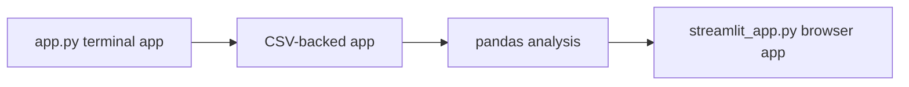

# Track Career Analyzer App

This folder contains Track Career Analyzer, a small Python project built during the bootcamp.

## What the app does
The app reads track result data from a CSV file and displays it so it is easier to review and analyze.

## How to run the terminal app
From the project root, run:

```bash
cd app
python3 app.py
```

## How to run the Streamlit app
From the project root, activate the virtual environment and start the browser app:

```bash
cd app
source ../.venv/bin/activate
streamlit run streamlit_app.py
```

## Where the data lives
The app reads its main data file from:

- [app/data/Results.csv](data/Results.csv)

A sample file is also available here:

- [app/data/sample_results.csv](data/sample_results.csv)

## Current phase
The app is currently in Phase 08, where it has moved from a terminal script to a Streamlit browser app.

## App Growth



## Run The Starter App

```bash
cd app
python3 app.py
```

## Install App Dependencies

Starting in Phase 07, use a local virtual environment before installing pandas and Streamlit:

```bash
python3 -m venv .venv
source .venv/bin/activate
python -m pip install -r requirements.txt
```

## Run The Streamlit App

This file exists after Phase 08:

```bash
cd app
streamlit run streamlit_app.py
```

Fallback:

```bash
cd app
python3 -m streamlit run streamlit_app.py
```

## Data

Sample data lives in `data/sample_results.csv`.

The student's working data file is `data/results.csv` once Phase 06 is complete.

## App Link

Deployment status: Not deployed yet. The app can be run locally with Streamlit.

## Final Demo

Use the repository-level final demo checklist:

```text
../docs/final-demo-checklist.md
```
